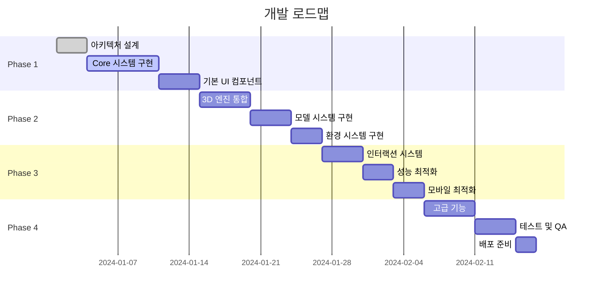

# 🌾 Animal Simulator - UI/UX 디자인 기획서

> **엔지니어 완전 개발 가능 수준의 상세 UI/UX 설계 문서**  
> **미래지향적 3D 농장 시뮬레이터 인터페이스 완전 설계서**

## 📋 목차
1. [디자인 시스템 개요](#디자인-시스템-개요)
2. [레이아웃 구조 설계](#레이아웃-구조-설계)
3. [Header 시스템 설계](#header-시스템-설계)
4. [Footer 시스템 설계](#footer-시스템-설계)
5. [핵심 UI 컴포넌트](#핵심-ui-컴포넌트)
6. [인터랙션 디자인](#인터랙션-디자인)
7. [반응형 디자인 시스템](#반응형-디자인-시스템)
8. [개발 구현 가이드](#개발-구현-가이드)

---

## 🎨 디자인 시스템 개요

### **🌟 디자인 철학: "Future Farm Experience"**

#### **핵심 디자인 원칙**
```typescript
interface DesignPhilosophy {
  // 1. 미래지향적 농장 경험
  futuristic: {
    concept: '2030년대 스마트 농장 관리 시스템'
    aesthetic: 'Cyber-Organic 융합'
    technology: 'Holographic UI + Tactile Feedback'
  }
  
  // 2. 직관적 상호작용
  intuitive: {
    principle: '3세 아이도 사용 가능한 인터페이스'
    interaction: 'Natural Gesture + Voice Command'
    feedback: 'Immediate Visual + Haptic Response'
  }
  
  // 3. 몰입형 경험
  immersive: {
    environment: '360도 농장 환경 몰입'
    transition: 'Seamless Reality-Virtual 전환'
    presence: 'Physical Presence in Digital Space'
  }
}
```

#### **🎯 타겟 사용자 페르소나**
```typescript
interface UserPersonas {
  primary: {
    name: '디지털 네이티브 (18-35세)'
    needs: ['빠른 학습', '즉각적 피드백', '소셜 공유']
    devices: ['스마트폰', '태블릿', '데스크톱']
    expectations: 'Netflix 수준의 UX 품질'
  }
  
  secondary: {
    name: '가족 사용자 (35-55세)'
    needs: ['안정성', '명확한 가이드', '자녀와 함께']
    devices: ['태블릿', '데스크톱']
    expectations: '직관적이고 안전한 환경'
  }
  
  accessibility: {
    name: '접근성 사용자'
    needs: ['스크린 리더', '키보드 네비게이션', '고대비']
    devices: ['보조 기술 연동']
    expectations: '동등한 경험 품질'
  }
}
```

### **🎨 Color System 2.0**

#### **미래지향적 컬러 팔레트**
```css
:root {
  /* 🌱 Primary: Bio-Tech Green */
  --primary-50: #f0fdf4;
  --primary-100: #dcfce7;
  --primary-200: #bbf7d0;
  --primary-300: #86efac;
  --primary-400: #4ade80;
  --primary-500: #22c55e; /* Main Brand */
  --primary-600: #16a34a;
  --primary-700: #15803d;
  --primary-800: #166534;
  --primary-900: #14532d;
  
  /* 🔮 Secondary: Cyber Blue */
  --secondary-50: #eff6ff;
  --secondary-100: #dbeafe;
  --secondary-200: #bfdbfe;
  --secondary-300: #93c5fd;
  --secondary-400: #60a5fa;
  --secondary-500: #3b82f6; /* Tech Accent */
  --secondary-600: #2563eb;
  --secondary-700: #1d4ed8;
  --secondary-800: #1e40af;
  --secondary-900: #1e3a8a;
  
  /* 🌅 Accent: Sunset Orange */
  --accent-50: #fff7ed;
  --accent-100: #ffedd5;
  --accent-200: #fed7aa;
  --accent-300: #fdba74;
  --accent-400: #fb923c;
  --accent-500: #f97316; /* Energy Color */
  --accent-600: #ea580c;
  --accent-700: #c2410c;
  --accent-800: #9a3412;
  --accent-900: #7c2d12;
  
  /* 🎭 Semantic Colors */
  --success: #10b981;
  --warning: #f59e0b;
  --error: #ef4444;
  --info: #06b6d4;
  
  /* 🌌 Neutral System */
  --neutral-0: #ffffff;
  --neutral-50: #fafafa;
  --neutral-100: #f4f4f5;
  --neutral-200: #e4e4e7;
  --neutral-300: #d4d4d8;
  --neutral-400: #a1a1aa;
  --neutral-500: #71717a;
  --neutral-600: #52525b;
  --neutral-700: #3f3f46;
  --neutral-800: #27272a;
  --neutral-900: #18181b;
  --neutral-950: #09090b;
}
```

#### **다크 테마 시스템**
```css
[data-theme="dark"] {
  /* 🌙 Dark Mode Overrides */
  --primary-500: #34d399; /* Brighter in dark */
  --secondary-500: #60a5fa;
  --accent-500: #fbbf24;
  
  /* Background Hierarchy */
  --bg-primary: #0c0a09;
  --bg-secondary: #1c1917;
  --bg-tertiary: #292524;
  --bg-elevated: #44403c;
  
  /* Glass Morphism Dark */
  --glass-bg: rgba(0, 0, 0, 0.4);
  --glass-border: rgba(255, 255, 255, 0.1);
  --glass-shadow: 0 8px 32px rgba(0, 0, 0, 0.4);
}
```

### **📐 Spacing & Typography System**

#### **공간 시스템 (8px Grid Base)**
```css
:root {
  /* Micro Spaces */
  --space-0: 0;
  --space-px: 1px;
  --space-0_5: 0.125rem; /* 2px */
  --space-1: 0.25rem;    /* 4px */
  --space-1_5: 0.375rem; /* 6px */
  --space-2: 0.5rem;     /* 8px - Base unit */
  
  /* Component Spaces */
  --space-3: 0.75rem;    /* 12px */
  --space-4: 1rem;       /* 16px */
  --space-5: 1.25rem;    /* 20px */
  --space-6: 1.5rem;     /* 24px */
  --space-8: 2rem;       /* 32px */
  --space-10: 2.5rem;    /* 40px */
  --space-12: 3rem;      /* 48px */
  
  /* Layout Spaces */
  --space-16: 4rem;      /* 64px */
  --space-20: 5rem;      /* 80px */
  --space-24: 6rem;      /* 96px */
  --space-32: 8rem;      /* 128px */
  --space-40: 10rem;     /* 160px */
  --space-48: 12rem;     /* 192px */
  --space-56: 14rem;     /* 224px */
  --space-64: 16rem;     /* 256px */
}
```

#### **타이포그래피 시스템**
```css
:root {
  /* Font Families */
  --font-primary: 'Inter Variable', 'Inter', system-ui, sans-serif;
  --font-display: 'Clash Display', 'Inter', system-ui, sans-serif;
  --font-mono: 'JetBrains Mono', 'Fira Code', monospace;
  
  /* Font Sizes (Type Scale) */
  --text-xs: 0.75rem;     /* 12px */
  --text-sm: 0.875rem;    /* 14px */
  --text-base: 1rem;      /* 16px - Base */
  --text-lg: 1.125rem;    /* 18px */
  --text-xl: 1.25rem;     /* 20px */
  --text-2xl: 1.5rem;     /* 24px */
  --text-3xl: 1.875rem;   /* 30px */
  --text-4xl: 2.25rem;    /* 36px */
  --text-5xl: 3rem;       /* 48px */
  --text-6xl: 3.75rem;    /* 60px */
  --text-7xl: 4.5rem;     /* 72px */
  --text-8xl: 6rem;       /* 96px */
  --text-9xl: 8rem;       /* 128px */
  
  /* Font Weights */
  --font-thin: 100;
  --font-light: 300;
  --font-normal: 400;
  --font-medium: 500;
  --font-semibold: 600;
  --font-bold: 700;
  --font-extrabold: 800;
  --font-black: 900;
  
  /* Line Heights */
  --leading-none: 1;
  --leading-tight: 1.25;
  --leading-snug: 1.375;
  --leading-normal: 1.5;
  --leading-relaxed: 1.625;
  --leading-loose: 2;
}
```

### **기존 아키텍처의 근본적 한계**

#### 🏚️ **Legacy 코드 구조**
```javascript
// Projects/scripts/main.js - 모놀리식 구조
import * as THREE from 'three';
import { camera, renderer } from './core/sceneManager.js';
import { init as initUI } from './UIManager.js';
import * as env from './environment.js';
import { loadScene } from './gridModels.js';

// ❌ 전역 변수 남발
let isInitialized = false;

// ❌ 절차적 초기화
async function init() {
    startApp((bus, ctx) => {
        loadScene();
        bus.register(new SkySystem());
        bus.register(new WeatherSystem());
    });
    initUI();
    initSeasonSyncUtil();
}
```

---

## 🏗️ 레이아웃 구조 설계

### **📱 전체 레이아웃 아키텍처**

#### **미래지향적 레이아웃 구조**
```
┌─────────────────────────────────────────────────────────────┐
│ 🎯 Global Header (72px)                                     │
│ ┌─ Brand ─┐ ┌─ Navigation ─┐ ┌─ User Actions ─┐           │
├─────────────────────────────────────────────────────────────┤
│ 🎮 Main Application Area                                    │
│ ┌─────────┬─────────────────────────────┬─────────────────┐ │
│ │ Left    │ 3D Scene Canvas             │ Right Control   │ │
│ │ Sidebar │ ┌─────────────────────────┐ │ Panel           │ │
│ │ (280px) │ │  🌾 Farm Simulation     │ │ (320px)         │ │
│ │         │ │                         │ │                 │ │
│ │ 🎁 Decor│ │    🐄 🐷 🐔 🌳 🏠      │ │ 🌦️ Weather    │ │
│ │ 🌿 Flora│ │                         │ │ 🌅 Time        │ │
│ │ 🐾 Fauna│ │  Interactive 3D Space   │ │ 🎚️ Settings   │ │
│ │ 🏗️ Build│ │                         │ │                 │ │
│ │         │ └─────────────────────────┘ │                 │ │
│ │         │ ┌─ Center Actions ─┐       │                 │ │
│ │         │ │    ➕    ❌      │       │                 │ │
│ └─────────┴─└─────────────────────────────┴─────────────────┘ │
├─────────────────────────────────────────────────────────────┤
│ 🎪 Floating Overlays (z-index layers)                      │
│ • Item Selection Panel (z-30)                              │
│ • Context Menus (z-40)                                     │
│ • Modals & Dialogs (z-50)                                  │
├─────────────────────────────────────────────────────────────┤
│ 🦶 Smart Footer (48px)                                     │
│ ┌─ Status ─┐ ┌─ Quick Stats ─┐ ┌─ Social ─┐              │
└─────────────────────────────────────────────────────────────┘
```

#### **CSS Grid 레이아웃 구현**
```css
/* 메인 앱 구조 */
.app-shell {
  display: grid;
  grid-template-rows: 72px 1fr 48px;
  grid-template-areas: 
    "header"
    "main"
    "footer";
  min-height: 100vh;
  background: var(--bg-primary);
}

/* 메인 콘텐츠 영역 */
.main-content {
  grid-area: main;
  display: grid;
  grid-template-columns: 280px 1fr 320px;
  grid-template-areas: "sidebar scene controls";
  gap: 0;
  overflow: hidden;
}

/* 반응형 브레이크포인트 */
@media (max-width: 1400px) {
  .main-content {
    grid-template-columns: 260px 1fr 280px;
  }
}

@media (max-width: 1200px) {
  .main-content {
    grid-template-columns: 240px 1fr;
    grid-template-areas: "sidebar scene";
  }
  
  .controls-dock {
    position: fixed;
    bottom: 48px;
    right: 0;
    transform: translateX(100%);
    transition: transform 0.3s ease;
  }
  
  .controls-dock.open {
    transform: translateX(0);
  }
}

@media (max-width: 768px) {
  .app-shell {
    grid-template-rows: 64px 1fr 56px;
  }
  
  .main-content {
    grid-template-columns: 1fr;
    grid-template-areas: "scene";
  }
  
  .sidebar {
    position: fixed;
    left: 0;
    top: 64px;
    bottom: 56px;
    transform: translateX(-100%);
    transition: transform 0.3s ease;
    z-index: 30;
  }
  
  .sidebar.open {
    transform: translateX(0);
  }
}
```

---

## 🎯 Header 시스템 설계

### **🌟 Future Header 컴포넌트**

#### **헤더 구조 및 기능**
```typescript
interface HeaderSystem {
  // 브랜드 영역
  brand: {
    logo: 'Animated SVG Logo'
    title: 'Animal Simulator'
    subtitle: 'Smart Farm Experience'
    onClick: () => void // 홈으로 이동
  }
  
  // 네비게이션 영역
  navigation: {
    primary: ['Dashboard', 'My Farms', 'Community', 'Marketplace']
    secondary: ['Tutorials', 'Help', 'Updates']
    activeIndicator: 'Glowing underline'
  }
  
  // 사용자 액션 영역
  userActions: {
    search: 'Global search with AI suggestions'
    notifications: 'Real-time activity feed'
    profile: 'User avatar with quick menu'
    settings: 'App preferences'
    theme: 'Light/Dark/Auto toggle'
  }
}
```

#### **헤더 비주얼 디자인**
```css
/* 🎯 Future Header Styles */
.app-header {
  grid-area: header;
  display: grid;
  grid-template-columns: auto 1fr auto;
  align-items: center;
  padding: 0 var(--space-6);
  background: var(--glass-bg);
  backdrop-filter: blur(20px);
  border-bottom: 1px solid var(--glass-border);
  position: sticky;
  top: 0;
  z-index: 100;
}

/* 브랜드 영역 */
.header-brand {
  display: flex;
  align-items: center;
  gap: var(--space-3);
  cursor: pointer;
  transition: transform 0.2s ease;
}

.header-brand:hover {
  transform: scale(1.02);
}

.brand-logo {
  width: 40px;
  height: 40px;
  position: relative;
}

.brand-logo svg {
  width: 100%;
  height: 100%;
  filter: drop-shadow(0 0 8px var(--primary-500));
  animation: logo-pulse 3s ease-in-out infinite;
}

@keyframes logo-pulse {
  0%, 100% { filter: drop-shadow(0 0 8px var(--primary-500)); }
  50% { filter: drop-shadow(0 0 16px var(--primary-400)); }
}

.brand-text {
  display: flex;
  flex-direction: column;
}

.brand-title {
  font-family: var(--font-display);
  font-size: var(--text-xl);
  font-weight: var(--font-bold);
  color: var(--primary-500);
  line-height: var(--leading-tight);
}

.brand-subtitle {
  font-size: var(--text-xs);
  color: var(--neutral-500);
  font-weight: var(--font-medium);
  text-transform: uppercase;
  letter-spacing: 0.05em;
}

/* 네비게이션 영역 */
.header-nav {
  display: flex;
  justify-content: center;
  gap: var(--space-8);
}

.nav-item {
  position: relative;
  padding: var(--space-2) var(--space-4);
  color: var(--neutral-600);
  font-weight: var(--font-medium);
  text-decoration: none;
  border-radius: var(--radius-lg);
  transition: all 0.2s ease;
}

.nav-item:hover {
  color: var(--primary-500);
  background: var(--primary-50);
}

.nav-item.active {
  color: var(--primary-600);
  background: var(--primary-100);
}

.nav-item.active::after {
  content: '';
  position: absolute;
  bottom: -1px;
  left: 50%;
  transform: translateX(-50%);
  width: 80%;
  height: 2px;
  background: linear-gradient(90deg, var(--primary-500), var(--secondary-500));
  border-radius: 1px;
  animation: nav-glow 2s ease-in-out infinite;
}

@keyframes nav-glow {
  0%, 100% { box-shadow: 0 0 4px var(--primary-500); }
  50% { box-shadow: 0 0 12px var(--primary-400); }
}

/* 사용자 액션 영역 */
.header-actions {
  display: flex;
  align-items: center;
  gap: var(--space-3);
}

.action-btn {
  width: 44px;
  height: 44px;
  border-radius: var(--radius-full);
  border: none;
  background: var(--glass-bg);
  backdrop-filter: blur(12px);
  border: 1px solid var(--glass-border);
  color: var(--neutral-600);
  cursor: pointer;
  transition: all 0.2s ease;
  position: relative;
  overflow: hidden;
}

.action-btn:hover {
  background: var(--primary-50);
  color: var(--primary-600);
  border-color: var(--primary-200);
  transform: translateY(-1px);
  box-shadow: 0 4px 12px rgba(0, 0, 0, 0.1);
}

.action-btn:active {
  transform: translateY(0);
}

/* 테마 토글 버튼 */
.theme-toggle {
  position: relative;
  overflow: hidden;
}

.theme-toggle::before {
  content: '';
  position: absolute;
  top: 50%;
  left: 50%;
  transform: translate(-50%, -50%);
  width: 100%;
  height: 100%;
  background: conic-gradient(from 0deg, var(--primary-500), var(--secondary-500), var(--accent-500), var(--primary-500));
  opacity: 0;
  transition: opacity 0.3s ease;
}

.theme-toggle:hover::before {
  opacity: 0.1;
}

/* 알림 배지 */
.notification-badge {
  position: absolute;
  top: 8px;
  right: 8px;
  width: 8px;
  height: 8px;
  background: var(--error);
  border-radius: 50%;
  animation: notification-pulse 2s ease-in-out infinite;
}

@keyframes notification-pulse {
  0%, 100% { transform: scale(1); opacity: 1; }
  50% { transform: scale(1.3); opacity: 0.7; }
}

/* 프로필 아바타 */
.profile-avatar {
  width: 36px;
  height: 36px;
  border-radius: var(--radius-full);
  border: 2px solid var(--primary-200);
  overflow: hidden;
  cursor: pointer;
  transition: all 0.2s ease;
}

.profile-avatar:hover {
  border-color: var(--primary-500);
  transform: scale(1.1);
  box-shadow: 0 0 16px var(--primary-200);
}

.profile-avatar img {
  width: 100%;
  height: 100%;
  object-fit: cover;
}
```

#### **헤더 반응형 동작**
```css
/* 모바일 헤더 적응 */
@media (max-width: 768px) {
  .app-header {
    padding: 0 var(--space-4);
    height: 64px;
  }
  
  .header-nav {
    display: none; /* 모바일에서 숨김 */
  }
  
  .mobile-menu-btn {
    display: flex; /* 모바일에서만 표시 */
    align-items: center;
    justify-content: center;
    width: 44px;
    height: 44px;
    border: none;
    background: transparent;
    color: var(--neutral-600);
    cursor: pointer;
  }
  
  .brand-subtitle {
    display: none; /* 모바일에서 숨김 */
  }
  
  .header-actions {
    gap: var(--space-2);
  }
  
  .action-btn {
    width: 40px;
    height: 40px;
  }
}

/* 태블릿 헤더 */
@media (max-width: 1024px) and (min-width: 769px) {
  .header-nav {
    gap: var(--space-4);
  }
  
  .nav-item {
    padding: var(--space-1) var(--space-3);
    font-size: var(--text-sm);
  }
}
```

---

## 🦶 Footer 시스템 설계

### **🌟 Smart Footer 컴포넌트**

#### **푸터 구조 및 기능**
```typescript
interface FooterSystem {
  // 상태 정보 영역
  status: {
    farmStats: {
      animals: number
      buildings: number
      happiness: number
      productivity: number
    }
    systemInfo: {
      fps: number
      memory: string
      connection: 'online' | 'offline'
      lastSaved: Date
    }
  }
  
  // 빠른 통계 영역
  quickStats: {
    realTime: {
      weather: WeatherType
      season: Season
      timeOfDay: TimeOfDay
      temperature: number
    }
    performance: {
      renderTime: number
      loadedAssets: number
      activeAnimations: number
    }
  }
  
  // 소셜 액션 영역
  social: {
    share: () => void
    screenshot: () => void
    record: () => void
    community: () => void
  }
}
```

#### **푸터 비주얼 디자인**
```css
/* 🦶 Smart Footer Styles */
.app-footer {
  grid-area: footer;
  display: grid;
  grid-template-columns: auto 1fr auto;
  align-items: center;
  padding: 0 var(--space-6);
  background: var(--glass-bg);
  backdrop-filter: blur(16px);
  border-top: 1px solid var(--glass-border);
  height: 48px;
  position: relative;
  overflow: hidden;
}

.app-footer::before {
  content: '';
  position: absolute;
  top: 0;
  left: 0;
  right: 0;
  height: 1px;
  background: linear-gradient(
    90deg,
    transparent,
    var(--primary-500),
    var(--secondary-500),
    var(--accent-500),
    transparent
  );
  animation: footer-glow 4s ease-in-out infinite;
}

@keyframes footer-glow {
  0%, 100% { opacity: 0.3; }
  50% { opacity: 0.8; }
}

/* 상태 정보 영역 */
.footer-status {
  display: flex;
  align-items: center;
  gap: var(--space-4);
}

.status-group {
  display: flex;
  align-items: center;
  gap: var(--space-2);
  padding: var(--space-1) var(--space-3);
  background: var(--glass-bg);
  border-radius: var(--radius-full);
  border: 1px solid var(--glass-border);
  font-size: var(--text-xs);
  font-weight: var(--font-medium);
}

.status-icon {
  width: 12px;
  height: 12px;
  border-radius: 50%;
  position: relative;
}

.status-icon.online {
  background: var(--success);
  box-shadow: 0 0 6px var(--success);
}

.status-icon.offline {
  background: var(--error);
  box-shadow: 0 0 6px var(--error);
}

.status-icon.loading {
  background: var(--warning);
  animation: status-pulse 1s ease-in-out infinite;
}

@keyframes status-pulse {
  0%, 100% { opacity: 1; transform: scale(1); }
  50% { opacity: 0.7; transform: scale(1.2); }
}

.status-value {
  color: var(--neutral-600);
  font-variant-numeric: tabular-nums;
}

.status-value.highlight {
  color: var(--primary-600);
  font-weight: var(--font-semibold);
}

/* 빠른 통계 영역 */
.footer-stats {
  display: flex;
  justify-content: center;
  align-items: center;
  gap: var(--space-6);
}

.stat-item {
  display: flex;
  flex-direction: column;
  align-items: center;
  gap: var(--space-1);
  min-width: 60px;
}

.stat-icon {
  font-size: var(--text-lg);
  line-height: 1;
}

.stat-label {
  font-size: var(--text-xs);
  color: var(--neutral-500);
  font-weight: var(--font-medium);
  text-transform: uppercase;
  letter-spacing: 0.05em;
}

.stat-value {
  font-size: var(--text-sm);
  color: var(--neutral-700);
  font-weight: var(--font-semibold);
  font-variant-numeric: tabular-nums;
}

/* 실시간 날씨 표시 */
.weather-display {
  display: flex;
  align-items: center;
  gap: var(--space-2);
  padding: var(--space-2) var(--space-3);
  background: var(--glass-bg);
  border-radius: var(--radius-lg);
  border: 1px solid var(--glass-border);
}

.weather-icon {
  font-size: var(--text-base);
  animation: weather-float 3s ease-in-out infinite;
}

@keyframes weather-float {
  0%, 100% { transform: translateY(0); }
  50% { transform: translateY(-2px); }
}

.weather-temp {
  font-size: var(--text-sm);
  font-weight: var(--font-semibold);
  color: var(--neutral-700);
}

/* 소셜 액션 영역 */
.footer-social {
  display: flex;
  align-items: center;
  gap: var(--space-2);
}

.social-btn {
  width: 36px;
  height: 36px;
  border-radius: var(--radius-lg);
  border: none;
  background: var(--glass-bg);
  border: 1px solid var(--glass-border);
  color: var(--neutral-600);
  cursor: pointer;
  transition: all 0.2s ease;
  position: relative;
  overflow: hidden;
}

.social-btn:hover {
  background: var(--primary-50);
  color: var(--primary-600);
  border-color: var(--primary-200);
  transform: translateY(-1px);
}

.social-btn:active {
  transform: translateY(0);
}

.social-btn.recording {
  background: var(--error);
  color: white;
  animation: recording-pulse 1s ease-in-out infinite;
}

@keyframes recording-pulse {
  0%, 100% { box-shadow: 0 0 0 0 var(--error); }
  50% { box-shadow: 0 0 0 4px rgba(239, 68, 68, 0.3); }
}
```

#### **푸터 반응형 동작**
```css
/* 모바일 푸터 적응 */
@media (max-width: 768px) {
  .app-footer {
    height: 56px;
    padding: 0 var(--space-4);
    grid-template-columns: 1fr auto;
  }
  
  .footer-stats {
    display: none; /* 모바일에서 숨김 */
  }
  
  .footer-status {
    gap: var(--space-2);
  }
  
  .status-group {
    padding: var(--space-1) var(--space-2);
    font-size: 10px;
  }
  
  .social-btn {
    width: 32px;
    height: 32px;
  }
}

/* 태블릿 푸터 */
@media (max-width: 1024px) and (min-width: 769px) {
  .footer-stats {
    gap: var(--space-4);
  }
  
  .stat-item {
    min-width: 50px;
  }
}

/* 초소형 디바이스 */
@media (max-width: 480px) {
  .app-footer {
    grid-template-columns: 1fr;
    justify-items: center;
  }
  
  .footer-status {
    justify-content: center;
  }
  
  .footer-social {
    position: absolute;
    right: var(--space-4);
    top: 50%;
    transform: translateY(-50%);
  }
}
```

---

## 🧩 컴포넌트 시스템 재설계

### **🎨 Design System 2.0**

#### **컴포넌트 계층 구조**
```
🏛️ Application Architecture
├── 🎪 App Shell (루트 컨테이너)
│   ├── GlobalProvider (테마, i18n, 상태)
│   ├── ErrorBoundary (에러 처리)
│   └── PerformanceMonitor (성능 모니터링)
├── 🎭 Layout System
│   ├── AdaptiveHeader (반응형 헤더)
│   ├── NavigationSidebar (네비게이션)
│   ├── MainCanvas (3D 씬)
│   ├── ControlDock (컨트롤 패널)
│   └── StatusBar (상태 표시)
├── 🎮 Interaction Components
│   ├── ModelPalette (모델 선택)
│   ├── EnvironmentControls (환경 설정)
│   ├── QuickActions (빠른 액션)
│   └── ContextMenu (컨텍스트 메뉴)
└── 🎯 Overlay System
    ├── LoadingOverlay (로딩 화면)
    ├── ModalSystem (모달 관리)
    ├── NotificationToast (알림)
    └── HelpOverlay (도움말)
```

#### **컴포넌트 설계 원칙**

##### 🔧 **Atomic Design 적용**
```typescript
// Atoms: 최소 단위 컴포넌트
interface Button {
  variant: 'primary' | 'secondary' | 'ghost'
  size: 'sm' | 'md' | 'lg'
  state: 'idle' | 'loading' | 'disabled'
  icon?: string
  onClick: () => void
}

// Molecules: 원자 조합
interface SearchInput {
  placeholder: string
  onSearch: (query: string) => void
  suggestions?: string[]
  isLoading: boolean
}

// Organisms: 복합 기능 단위
interface ModelBrowser {
  categories: Category[]
  selectedCategory: string
  onModelSelect: (model: Model) => void
  searchQuery: string
  viewMode: 'grid' | 'list'
}

// Templates: 페이지 레이아웃
interface SimulatorLayout {
  sidebar: React.ComponentType
  canvas: React.ComponentType
  controls: React.ComponentType
  overlay?: React.ComponentType
}
```

##### 🎨 **Design Token System**
```typescript
// 디자인 토큰 중앙 관리
export const DesignTokens = {
  colors: {
    primary: {
      50: '#eef2ff',
      100: '#e0e7ff',
      500: '#6366f1',
      900: '#312e81'
    },
    semantic: {
      success: '#10b981',
      warning: '#f59e0b',
      error: '#ef4444',
      info: '#3b82f6'
    }
  },
  spacing: {
    xs: '0.25rem',
    sm: '0.5rem',
    md: '1rem',
    lg: '1.5rem',
    xl: '2rem'
  },
  typography: {
    fontFamily: {
      primary: ['Inter', 'system-ui', 'sans-serif'],
      mono: ['JetBrains Mono', 'monospace']
    },
    fontSize: {
      xs: '0.75rem',
      sm: '0.875rem',
      base: '1rem',
      lg: '1.125rem',
      xl: '1.25rem'
    }
  },
  animations: {
    duration: {
      fast: '150ms',
      normal: '300ms',
      slow: '500ms'
    },
    easing: {
      linear: 'linear',
      easeIn: 'cubic-bezier(0.4, 0, 1, 1)',
      easeOut: 'cubic-bezier(0, 0, 0.2, 1)',
      easeInOut: 'cubic-bezier(0.4, 0, 0.2, 1)'
    }
  }
}
```

### **🎪 신규 HTML 구조**

#### **Application Shell 2.0**
```html
<!DOCTYPE html>
<html lang="ko" data-theme="system" data-performance="auto">
<head>
  <!-- 🎯 Critical Meta -->
  <meta charset="UTF-8">
  <meta name="viewport" content="width=device-width, initial-scale=1.0, viewport-fit=cover, user-scalable=no">
  
  <!-- 🚀 Performance Optimization -->
  <link rel="dns-prefetch" href="//fonts.googleapis.com">
  <link rel="dns-prefetch" href="//cdn.jsdelivr.net">
  <link rel="preconnect" href="https://fonts.gstatic.com" crossorigin>
  <link rel="modulepreload" href="/src/main.ts">
  <link rel="modulepreload" href="/src/core/ThreeJSCore.ts">
  <link rel="preload" href="/fonts/Inter-Variable.woff2" as="font" type="font/woff2" crossorigin>
  
  <!-- 📱 Progressive Web App -->
  <link rel="manifest" href="/manifest.json">
  <meta name="theme-color" content="#6366f1">
  <meta name="apple-mobile-web-app-capable" content="yes">
  <meta name="apple-mobile-web-app-status-bar-style" content="black-translucent">
  <meta name="apple-mobile-web-app-title" content="Farm Simulator">
  
  <!-- 🌐 SEO & Social -->
  <title>🌾 Animal Farm Simulator - Next Generation 3D Experience</title>
  <meta name="description" content="차세대 3D 농장 시뮬레이터 - Vue3, TypeScript, Three.js로 구현된 몰입형 가상 농장 체험">
  <meta name="keywords" content="3D simulation, farm game, Vue3, TypeScript, Three.js, virtual reality, interactive">
  
  <!-- Open Graph -->
  <meta property="og:title" content="🌾 Animal Farm Simulator">
  <meta property="og:description" content="차세대 3D 농장 시뮬레이터">
  <meta property="og:type" content="website">
  <meta property="og:image" content="/og-image.jpg">
  
  <!-- 🎨 Design System CSS Variables -->
  <style id="design-tokens">
    :root {
      /* Color System */
      --primary-50: #eef2ff;
      --primary-500: #6366f1;
      --primary-900: #312e81;
      
      /* Spacing System */
      --space-xs: 0.25rem;
      --space-sm: 0.5rem;
      --space-md: 1rem;
      --space-lg: 1.5rem;
      --space-xl: 2rem;
      
      /* Typography */
      --font-family-primary: 'Inter Variable', system-ui, sans-serif;
      --font-size-xs: 0.75rem;
      --font-size-sm: 0.875rem;
      --font-size-base: 1rem;
      
      /* Animation */
      --duration-fast: 150ms;
      --duration-normal: 300ms;
      --easing-ease-out: cubic-bezier(0, 0, 0.2, 1);
      
      /* Shadows */
      --shadow-sm: 0 1px 2px 0 rgba(0, 0, 0, 0.05);
      --shadow-md: 0 4px 6px -1px rgba(0, 0, 0, 0.1);
      --shadow-lg: 0 10px 15px -3px rgba(0, 0, 0, 0.1);
      
      /* Glass Effect */
      --glass-bg: rgba(255, 255, 255, 0.1);
      --glass-border: rgba(255, 255, 255, 0.2);
      --glass-blur: blur(20px);
    }
    
    /* Dark Theme */
    [data-theme="dark"] {
      --primary-50: #312e81;
      --primary-500: #818cf8;
      --primary-900: #e0e7ff;
      --glass-bg: rgba(0, 0, 0, 0.2);
      --glass-border: rgba(255, 255, 255, 0.1);
    }
  </style>
</head>

<body>
  <!-- 🎪 Application Shell -->
  <div id="app" class="app-shell" data-state="loading">
    
    <!-- 🎭 Loading Experience System -->
    <div id="loading-experience" class="loading-experience" role="dialog" aria-label="애플리케이션 로딩 중">
      
      <!-- Immersive Background -->
      <div class="loading-background">
        <div class="animated-gradient"></div>
        <div class="floating-particles"></div>
      </div>
      
      <!-- Brand & Context -->
      <div class="loading-content">
        <header class="brand-header">
          <div class="brand-logo" role="img" aria-label="농장 로고">
            <svg class="logo-icon" viewBox="0 0 100 100">
              <path d="M20,80 Q20,20 50,20 Q80,20 80,80" fill="none" stroke="currentColor" stroke-width="3"/>
              <circle cx="30" cy="70" r="3" fill="currentColor"/>
              <circle cx="50" cy="65" r="3" fill="currentColor"/>
              <circle cx="70" cy="70" r="3" fill="currentColor"/>
            </svg>
          </div>
          <div class="brand-text">
            <h1 class="brand-title">Animal Farm Simulator</h1>
            <p class="brand-subtitle">차세대 3D 농장 시뮬레이션</p>
          </div>
        </header>
        
        <!-- Intelligent Progress System -->
        <div class="progress-system">
          <div class="progress-visualization">
            <svg class="progress-ring" viewBox="0 0 120 120">
              <circle cx="60" cy="60" r="54" fill="none" stroke="var(--glass-border)" stroke-width="8"/>
              <circle cx="60" cy="60" r="54" fill="none" stroke="var(--primary-500)" stroke-width="8" 
                      stroke-dasharray="339.292" stroke-dashoffset="339.292" id="progress-circle"
                      transform="rotate(-90 60 60)" stroke-linecap="round"/>
            </svg>
            <div class="progress-center">
              <span class="progress-percentage" id="progress-percentage">0%</span>
              <span class="progress-stage" id="progress-stage">초기화 중...</span>
            </div>
          </div>
          
          <!-- Detailed Loading Steps -->
          <div class="loading-steps">
            <div class="step" data-step="init" data-state="active">
              <div class="step-icon">🔧</div>
              <div class="step-content">
                <div class="step-title">시스템 초기화</div>
                <div class="step-description">WebGL 및 성능 최적화</div>
              </div>
            </div>
            <div class="step" data-step="assets" data-state="pending">
              <div class="step-icon">📦</div>
              <div class="step-content">
                <div class="step-title">에셋 로딩</div>
                <div class="step-description">3D 모델 및 텍스처</div>
              </div>
            </div>
            <div class="step" data-step="world" data-state="pending">
              <div class="step-icon">🌍</div>
              <div class="step-content">
                <div class="step-title">세계 구성</div>
                <div class="step-description">환경 및 물리 시뮬레이션</div>
              </div>
            </div>
            <div class="step" data-step="ready" data-state="pending">
              <div class="step-icon">✨</div>
              <div class="step-content">
                <div class="step-title">완료</div>
                <div class="step-description">농장으로 입장 준비</div>
              </div>
            </div>
          </div>
        </div>
        
        <!-- System Information -->
        <div class="system-info">
          <div class="info-grid">
            <div class="info-item">
              <span class="info-label">WebGL</span>
              <span class="info-value" id="webgl-info">확인 중...</span>
            </div>
            <div class="info-item">
              <span class="info-label">성능</span>
              <span class="info-value" id="performance-info">분석 중...</span>
            </div>
            <div class="info-item">
              <span class="info-label">메모리</span>
              <span class="info-value" id="memory-info">최적화 중...</span>
            </div>
            <div class="info-item">
              <span class="info-label">디바이스</span>
              <span class="info-value" id="device-info">감지 중...</span>
            </div>
          </div>
        </div>
        
        <!-- Loading Tips -->
        <div class="loading-tips">
          <div class="tip-content" id="loading-tip">
            💡 팁: 마우스 드래그로 시점을 회전할 수 있어요!
          </div>
        </div>
      </div>
    </div>
    
    <!-- 🚨 Advanced Error System -->
    <div id="error-system" class="error-system hidden" role="alert" aria-live="assertive">
      <div class="error-background">
        <div class="error-pattern"></div>
      </div>
      <div class="error-content">
        <div class="error-header">
          <div class="error-icon">⚠️</div>
          <h2 class="error-title">로딩 실패</h2>
        </div>
        <div class="error-body">
          <p class="error-message" id="error-message">예상치 못한 오류가 발생했습니다.</p>
          <div class="error-details" id="error-details" style="display: none;">
            <summary>기술적 세부사항</summary>
            <pre id="error-stack"></pre>
          </div>
        </div>
        <div class="error-actions">
          <button class="btn btn-primary" onclick="window.location.reload()">
            <span class="btn-icon">🔄</span>
            <span class="btn-text">다시 시도</span>
          </button>
          <button class="btn btn-secondary" id="safe-mode-btn">
            <span class="btn-icon">🛡️</span>
            <span class="btn-text">안전 모드</span>
          </button>
          <button class="btn btn-ghost" id="report-error-btn">
            <span class="btn-icon">📝</span>
            <span class="btn-text">오류 신고</span>
          </button>
        </div>
        <div class="error-help">
          <p>문제가 지속되면 <a href="/help" target="_blank">도움말 센터</a>를 참고하세요.</p>
        </div>
      </div>
    </div>
  </div>

  <!-- 🎯 Critical Inline Styles -->
  <style>
    /* Critical CSS for loading experience */
    .app-shell {
      min-height: 100vh;
      display: flex;
      align-items: center;
      justify-content: center;
      background: linear-gradient(135deg, #667eea 0%, #764ba2 100%);
      font-family: -apple-system, BlinkMacSystemFont, 'Segoe UI', sans-serif;
    }
    
    .loading-system {
      max-width: 480px;
      width: 90%;
      padding: 2rem;
      background: rgba(255, 255, 255, 0.1);
      backdrop-filter: blur(20px);
      border-radius: 20px;
      border: 1px solid rgba(255, 255, 255, 0.2);
      text-align: center;
      color: white;
    }
    
    .brand-logo {
      font-size: 4rem;
      margin-bottom: 1rem;
      animation: float 3s ease-in-out infinite;
    }
    
    .progress-bar {
      width: 100%;
      height: 8px;
      background: rgba(255, 255, 255, 0.2);
      border-radius: 4px;
      overflow: hidden;
      margin: 2rem 0;
    }
    
    .progress-fill {
      height: 100%;
      background: linear-gradient(90deg, #00ff88, #00d4ff);
      width: 0%;
      transition: width 0.5s ease;
      border-radius: 4px;
    }
    
    .progress-steps {
      display: grid;
      grid-template-columns: repeat(auto-fit, minmax(120px, 1fr));
      gap: 1rem;
      margin: 1.5rem 0;
    }
    
    .step {
      padding: 0.5rem;
      border-radius: 8px;
      background: rgba(255, 255, 255, 0.1);
      font-size: 0.875rem;
      opacity: 0.5;
      transition: all 0.3s ease;
    }
    
    .step.active {
      opacity: 1;
      background: rgba(255, 255, 255, 0.2);
      transform: scale(1.05);
    }
    
    .system-status {
      display: flex;
      justify-content: space-between;
      margin-top: 1.5rem;
      font-size: 0.75rem;
      opacity: 0.8;
    }
    
    .error-system {
      max-width: 400px;
      width: 90%;
      padding: 2rem;
      background: rgba(220, 38, 38, 0.1);
      backdrop-filter: blur(20px);
      border-radius: 20px;
      border: 1px solid rgba(220, 38, 38, 0.3);
      text-align: center;
      color: white;
    }
    
    .hidden { display: none; }
    
    @keyframes float {
      0%, 100% { transform: translateY(0px); }
      50% { transform: translateY(-10px); }
    }
    
    /* Mobile Optimizations */
    @media (max-width: 768px) {
      .loading-system, .error-system {
        padding: 1.5rem;
        border-radius: 16px;
      }
      
      .brand-logo { font-size: 3rem; }
      
      .progress-steps {
        grid-template-columns: repeat(2, 1fr);
      }
      
      .system-status {
        flex-direction: column;
        gap: 0.5rem;
      }
    }
  </style>

  <!-- 🚀 Loading Script -->
  <script>
    // Loading system controller
    class LoadingSystem {
      constructor() {
        this.currentStep = 0;
        this.steps = ['models', 'textures', 'environment', 'ready'];
        this.progress = 0;
        this.checkWebGL();
      }
      
      checkWebGL() {
        const canvas = document.createElement('canvas');
        const gl = canvas.getContext('webgl2') || canvas.getContext('webgl');
        const status = document.getElementById('webgl-status');
        
        if (gl) {
          status.textContent = '✅ Supported';
          status.style.color = '#00ff88';
        } else {
          status.textContent = '❌ Not Supported';
          status.style.color = '#ff4444';
          this.showError('WebGL is not supported in your browser');
        }
      }
      
      updateProgress(percent, step) {
        this.progress = Math.min(100, Math.max(0, percent));
        document.getElementById('progress-fill').style.width = this.progress + '%';
        
        if (step !== undefined) {
          this.updateStep(step);
        }
      }
      
      updateStep(stepName) {
        const stepIndex = this.steps.indexOf(stepName);
        if (stepIndex !== -1) {
          // Remove active class from all steps
          document.querySelectorAll('.step').forEach(el => el.classList.remove('active'));
          
          // Add active class to current step
          const currentStepEl = document.querySelector(`[data-step="${stepName}"]`);
          if (currentStepEl) {
            currentStepEl.classList.add('active');
          }
          
          this.currentStep = stepIndex;
        }
      }
      
      showError(message) {
        document.getElementById('error-message').textContent = message;
        document.getElementById('loading-system').classList.add('hidden');
        document.getElementById('error-system').classList.remove('hidden');
      }
      
      complete() {
        this.updateProgress(100, 'ready');
        setTimeout(() => {
          document.getElementById('loading-system').style.opacity = '0';
          setTimeout(() => {
            document.getElementById('loading-system').remove();
          }, 500);
        }, 1000);
      }
    }
    
    // Global loading system instance
    window.loadingSystem = new LoadingSystem();
    
    // Safe mode handler
    document.getElementById('safe-mode').addEventListener('click', () => {
      localStorage.setItem('safe-mode', 'true');
      location.reload();
    });
  </script>

  <!-- 🎯 Main Application -->
  <script type="module" src="/src/main.ts"></script>
</body>
</html>
```

---

## 🚀 사용자 경험 혁신

### **🎭 몰입형 인터페이스 디자인**

#### **1. 적응형 UI 시스템**
```typescript
// 컨텍스트 기반 UI 적응
interface AdaptiveUISystem {
  // 디바이스별 최적화
  detectDevice(): DeviceType
  optimizeForDevice(device: DeviceType): UIConfig
  
  // 성능 기반 적응
  monitorPerformance(): PerformanceMetrics
  adjustQuality(metrics: PerformanceMetrics): QualitySettings
  
  // 사용자 선호도 학습
  trackUserBehavior(): UserPreferences
  personalizeInterface(preferences: UserPreferences): UIPersonalization
}

// 실시간 적응 예시
const adaptiveUI = {
  // 저사양 디바이스: 단순화된 UI
  lowEnd: {
    particleCount: 50,
    shadowQuality: 'low',
    uiAnimations: 'reduced'
  },
  
  // 고사양 디바이스: 풀 피처 UI
  highEnd: {
    particleCount: 500,
    shadowQuality: 'ultra',
    uiAnimations: 'enhanced',
    extraEffects: true
  }
}
```

#### **2. 마이크로 인터랙션 시스템**
```css
/* 섬세한 피드백 시스템 */
.interactive-element {
  transition: all var(--duration-normal) var(--easing-ease-out);
}

.interactive-element:hover {
  transform: translateY(-2px) scale(1.02);
  box-shadow: var(--shadow-lg);
}

.interactive-element:active {
  transform: translateY(0) scale(0.98);
  transition-duration: var(--duration-fast);
}

/* 상태별 시각적 피드백 */
.element[data-state="loading"] {
  animation: pulse 2s cubic-bezier(0.4, 0, 0.6, 1) infinite;
}

.element[data-state="success"] {
  animation: success-bounce 0.6s ease-out;
}

.element[data-state="error"] {
  animation: error-shake 0.5s ease-in-out;
}
```

#### **3. 몰입형 로딩 경험**
```typescript
// 지능형 로딩 시스템
class ImmersiveLoadingSystem {
  private tips = [
    "🐄 소는 하루에 최대 40리터의 우유를 생산할 수 있어요!",
    "🌱 작물은 계절에 따라 성장 속도가 달라집니다.",
    "🏠 건물을 적절히 배치하면 효율성이 크게 향상됩니다.",
    "🌦️ 날씨 변화에 따라 동물들의 행동도 바뀝니다."
  ]
  
  async createEngagingExperience() {
    // 배경 애니메이션 시작
    this.startBackgroundAnimation()
    
    // 로딩 팁 순환 표시
    this.rotateTips()
    
    // 진행률에 따른 시각적 변화
    this.adaptVisualsByProgress()
    
    // 사운드 피드백 (선택사항)
    this.playAmbientSounds()
  }
  
  private adaptVisualsByProgress() {
    // 0-25%: 시스템 초기화 (기계적 애니메이션)
    // 25-50%: 자연 요소 로딩 (유기적 애니메이션)  
    // 50-75%: 생명체 추가 (생동감 있는 애니메이션)
    // 75-100%: 완성된 농장 (조화로운 애니메이션)
  }
}
```

### **🎮 혁신적 인터랙션 패러다임**

#### **1. 제스처 기반 조작 (모바일)**
```typescript
interface GestureSystem {
  // 기본 제스처
  tap: (target: Object3D) => void          // 선택
  longPress: (target: Object3D) => void    // 컨텍스트 메뉴
  drag: (from: Vector3, to: Vector3) => void // 이동
  pinch: (scale: number) => void           // 줌
  rotate: (angle: number) => void          // 회전
  
  // 고급 제스처
  twoFingerTap: () => void                 // 되돌리기
  threeFingerTap: () => void               // 메뉴 토글
  swipeUp: () => void                      // 빠른 액션
  swipeDown: () => void                    // 정보 패널
}
```

#### **2. 음성 명령 지원**
```typescript
interface VoiceControlSystem {
  commands: {
    "농장 보기": () => void
    "소 추가해줘": () => void
    "날씨 바꿔줘": () => void
    "저장해줘": () => void
    "도움말": () => void
  }
  
  // 자연어 처리
  processNaturalLanguage(input: string): Command | null
  
  // 접근성 지원
  enableScreenReaderMode(): void
  provideSpatialAudioFeedback(): void
}
```

#### **3. 햅틱 피드백 (지원 디바이스)**
```typescript
interface HapticFeedbackSystem {
  // 기본 피드백
  lightTap(): void        // 버튼 클릭
  mediumTap(): void       // 선택 확인
  heavyTap(): void        // 중요한 액션
  
  // 맥락적 피드백
  animalInteraction(): void    // 동물과 상호작용
  buildingPlacement(): void    // 건물 배치
  weatherChange(): void        // 날씨 변화
  
  // 패턴 피드백
  successPattern(): void       // 성공 시
  errorPattern(): void         // 오류 시
  notificationPattern(): void  // 알림
}
```

---

## ⚡ 기술적 혁신 요소

### **🔬 차세대 기술 스택**

#### **1. 성능 최적화 아키텍처**
```typescript
// 지능형 리소스 관리
class IntelligentResourceManager {
  private resourcePool = new Map<string, Resource>()
  private loadingQueue = new PriorityQueue<LoadTask>()
  private memoryMonitor = new MemoryMonitor()
  
  // 적응적 품질 조정
  async adaptiveQualityControl() {
    const metrics = await this.memoryMonitor.getMetrics()
    
    if (metrics.memoryUsage > 0.8) {
      this.reduceQuality()
      this.garbageCollectUnused()
    }
    
    if (metrics.frameRate < 30) {
      this.optimizeRenderPipeline()
    }
  }
  
  // 예측적 로딩
  async predictiveLoading(userBehavior: UserAction[]) {
    const predictions = this.ml.predictNextActions(userBehavior)
    
    for (const prediction of predictions) {
      if (prediction.confidence > 0.7) {
        this.preloadResource(prediction.resource)
      }
    }
  }
}
```

#### **2. 실시간 협업 시스템**
```typescript
// 멀티플레이어 지원
interface CollaborationSystem {
  // 실시간 동기화
  syncState(state: FarmState): void
  broadcastAction(action: UserAction): void
  handleRemoteAction(action: RemoteAction): void
  
  // 충돌 해결
  resolveConflict(conflict: StateConflict): Resolution
  
  // 권한 관리
  checkPermission(user: User, action: Action): boolean
  delegatePermission(from: User, to: User, scope: PermissionScope): void
}

// 실시간 통신
class RealtimeSync {
  private websocket: WebSocket
  private p2p: RTCPeerConnection[]
  
  async establishConnection() {
    // WebRTC P2P 연결 우선, 실패 시 서버 경유
    try {
      await this.setupP2PConnection()
    } catch (error) {
      await this.fallbackToServerRelay()
    }
  }
}
```

#### **3. AI 기반 지능형 시뮬레이션**
```typescript
// 스마트 AI 시스템
class IntelligentSimulation {
  private animalAI = new AnimalBehaviorAI()
  private weatherAI = new WeatherPredictionAI()
  private economyAI = new MarketSimulationAI()
  
  // 동물 행동 AI
  simulateAnimalBehavior(animal: Animal, environment: Environment) {
    const behavior = this.animalAI.predict({
      animalType: animal.type,
      hunger: animal.hunger,
      mood: animal.mood,
      weather: environment.weather,
      timeOfDay: environment.timeOfDay,
      nearbyAnimals: environment.getNearbyAnimals(animal)
    })
    
    return behavior
  }
  
  // 날씨 예측 시스템
  predictWeatherPattern(currentWeather: WeatherState, season: Season) {
    return this.weatherAI.generateRealisticWeatherSequence({
      current: currentWeather,
      season: season,
      geographicLocation: this.farm.location
    })
  }
  
  // 경제 시뮬레이션
  simulateMarketDynamics(farmOutput: Production[], globalEvents: Event[]) {
    return this.economyAI.calculateMarketPrices({
      supply: farmOutput,
      demand: this.getMarketDemand(),
      externalFactors: globalEvents
    })
  }
}
```

### **🛡️ 보안 및 개인정보 보호**

#### **1. 클라이언트 사이드 보안**
```typescript
// 보안 강화 시스템
class SecuritySystem {
  // 입력 검증 및 새니타이제이션
  validateUserInput(input: unknown): SafeInput | SecurityError {
    return this.inputValidator.validate(input)
  }
  
  // XSS 방지
  sanitizeContent(content: string): string {
    return this.xssProtector.sanitize(content)
  }
  
  // 클라이언트 사이드 암호화
  encryptSensitiveData(data: SensitiveData): EncryptedData {
    return this.crypto.encrypt(data, this.getUserKey())
  }
  
  // 무결성 검증
  verifyAssetIntegrity(asset: Asset): boolean {
    return this.integrityChecker.verify(asset.hash, asset.content)
  }
}
```

#### **2. 개인정보 보호**
```typescript
// 프라이버시 우선 설계
class PrivacySystem {
  // 로컬 우선 저장
  saveUserData(data: UserData): void {
    // 민감한 데이터는 로컬에만 저장
    this.localStorage.encrypt(data.sensitive)
    
    // 비민감한 데이터만 서버 동기화
    this.syncToServer(data.nonSensitive)
  }
  
  // 익명화된 텔레메트리
  collectAnonymousMetrics(metrics: PerformanceMetrics): void {
    const anonymized = this.anonymizer.process(metrics)
    this.telemetry.send(anonymized)
  }
  
  // 사용자 제어 권한
  getUserConsent(dataType: DataType): boolean {
    return this.consentManager.hasConsent(dataType)
  }
}
```

### **📊 고급 분석 및 모니터링**

#### **1. 실시간 성능 모니터링**
```typescript
// 성능 모니터링 대시보드
class PerformanceMonitor {
  private metrics = {
    fps: new RollingAverage(60),
    memoryUsage: new MemoryTracker(),
    networkLatency: new LatencyTracker(),
    userEngagement: new EngagementTracker()
  }
  
  // 실시간 메트릭 수집
  collectMetrics(): PerformanceSnapshot {
    return {
      timestamp: Date.now(),
      fps: this.metrics.fps.current(),
      memory: this.metrics.memoryUsage.snapshot(),
      network: this.metrics.networkLatency.average(),
      engagement: this.metrics.userEngagement.score()
    }
  }
  
  // 성능 이상 감지
  detectAnomalies(metrics: PerformanceSnapshot): Anomaly[] {
    const anomalies: Anomaly[] = []
    
    if (metrics.fps < 30) {
      anomalies.push({ type: 'low_fps', severity: 'high' })
    }
    
    if (metrics.memory.usage > 0.9) {
      anomalies.push({ type: 'memory_leak', severity: 'critical' })
    }
    
    return anomalies
  }
}
```

#### **2. 사용자 행동 분석**
```typescript
// 사용자 경험 최적화
class UXAnalytics {
  // 사용자 여정 추적
  trackUserJourney(action: UserAction): void {
    this.journeyTracker.record({
      action: action.type,
      timestamp: Date.now(),
      context: action.context,
      duration: action.duration
    })
  }
  
  // A/B 테스트 시스템
  runABTest(testName: string, variants: Variant[]): TestResult {
    const userGroup = this.assignUserToGroup()
    const variant = variants[userGroup]
    
    this.applyVariant(variant)
    return this.trackConversion(testName, variant)
  }
  
  // 개인화 추천
  generateRecommendations(user: User): Recommendation[] {
    const behavior = this.getUserBehaviorPattern(user)
    return this.recommendationEngine.generate(behavior)
  }
}
```

---

## 🗺️ 구현 로드맵

### **Phase 1: Foundation (1-2주)**


#### **🎯 1단계 목표**
- [x] **아키텍처 설계**: 모듈러 시스템 구조 확정
- [x] **TypeScript 설정**: 타입 안전성 보장
- [x] **Vue3 + Vite 환경**: 개발 환경 구축
- [ ] **Core 시스템**: ThreeJSCore, EventBus, StateManager
- [ ] **Design System**: 토큰 시스템, 기본 컴포넌트

#### **🛠️ 기술적 마일스톤**
```typescript
// 1단계 완료 기준
interface Phase1Deliverables {
  architecture: {
    systemDesign: '✅ 완료'
    typeDefinitions: '🔄 진행 중'
    moduleStructure: '✅ 완료'
  }
  
  coreFeatures: {
    threeJSIntegration: '🔄 진행 중'
    componentSystem: '📅 예정'
    stateManagement: '📅 예정'
  }
  
  qualityGates: {
    typeScript: 'strict mode 통과'
    eslint: '0 errors, 0 warnings'
    performance: 'Lighthouse > 90점'
  }
}
```

### **Phase 2: Core Features (2-3주)**

#### **🎮 2단계 목표**
- [ ] **3D 엔진 완성**: Three.js 시스템 완전 통합
- [ ] **모델 관리**: GLTF 로딩, 애니메이션, 텍스처 시스템
- [ ] **환경 시뮬레이션**: 날씨, 계절, 물리 시뮬레이션
- [ ] **기본 인터랙션**: 마우스/터치 조작, 모델 배치

#### **📊 성능 목표**
| 메트릭 | 목표 값 | 현재 값 |
|--------|---------|---------|
| **First Contentful Paint** | < 1.5초 | TBD |
| **Time to Interactive** | < 3초 | TBD |
| **Frame Rate** | > 60 FPS | TBD |
| **Memory Usage** | < 200MB | TBD |
| **Bundle Size** | < 2MB (gzipped) | TBD |

### **Phase 3: Advanced Features (3-4주)**

#### **🚀 3단계 목표**
- [ ] **고급 인터랙션**: 제스처, 음성 명령, 햅틱 피드백
- [ ] **AI 시뮬레이션**: 동물 행동, 날씨 예측, 경제 시뮬레이션
- [ ] **멀티플레이어**: 실시간 협업, P2P 통신
- [ ] **PWA 기능**: 오프라인 지원, 푸시 알림

#### **🎯 혁신 기능**
```typescript
// 차별화 요소
interface InnovativeFeatures {
  aiDriven: {
    animalBehavior: 'ML 기반 동물 행동 시뮬레이션'
    weatherPrediction: '실제 기상 데이터 연동'
    marketSimulation: '동적 경제 시스템'
  }
  
  collaboration: {
    realTimeSync: 'WebRTC P2P 동기화'
    voiceChat: '내장 음성 채팅'
    sharedWorkspace: '공유 농장 관리'
  }
  
  accessibility: {
    screenReader: '완전한 스크린 리더 지원'
    voiceControl: '음성 명령 인터페이스'
    hapticFeedback: '햅틱 피드백 시스템'
  }
}
```

### **Phase 4: Polish & Launch (1-2주)**

#### **✨ 4단계 목표**
- [ ] **성능 최적화**: 메모리 최적화, 렌더링 최적화
- [ ] **품질 보증**: 자동화된 테스트, 크로스 브라우저 테스트
- [ ] **사용자 경험**: A/B 테스트, 사용성 테스트
- [ ] **배포 준비**: CI/CD 파이프라인, 모니터링 시스템

#### **📈 출시 준비 체크리스트**
```yaml
# 출시 전 필수 점검 사항
quality_gates:
  performance:
    - lighthouse_score: "> 90"
    - core_web_vitals: "모든 메트릭 Good"
    - memory_leaks: "없음"
    - frame_drops: "< 1%"
  
  compatibility:
    - browsers: "Chrome, Firefox, Safari, Edge"
    - devices: "Desktop, Tablet, Mobile"
    - screen_readers: "NVDA, JAWS, VoiceOver"
  
  security:
    - xss_vulnerabilities: "없음"
    - dependency_audit: "취약점 없음"
    - csp_headers: "설정 완료"
  
  monitoring:
    - error_tracking: "Sentry 연동"
    - performance_monitoring: "Web Vitals 추적"
    - user_analytics: "개인정보 보호 준수"
```

---

## 🔄 마이그레이션 전략

### **🎯 Legacy → Modern 전환 계획**

#### **1. 점진적 마이그레이션 전략**
```typescript
// 하이브리드 마이그레이션 접근법
interface MigrationStrategy {
  phase1: {
    description: 'Vue3 앱 셸 구축'
    approach: 'Legacy 코드를 iframe으로 임베드'
    timeline: '1주'
    rollback: '즉시 가능'
  }
  
  phase2: {
    description: 'Core 시스템 이전'
    approach: 'Three.js 코드를 TypeScript로 리팩토링'
    timeline: '2주'
    rollback: '1일 내 가능'
  }
  
  phase3: {
    description: 'UI 컴포넌트 이전'
    approach: 'jQuery DOM 조작을 Vue 컴포넌트로 전환'
    timeline: '2주'
    rollback: '기능별 개별 롤백'
  }
  
  phase4: {
    description: 'Legacy 코드 완전 제거'
    approach: '모든 기능 검증 후 제거'
    timeline: '1주'
    rollback: '백업에서 복원'
  }
}
```

#### **2. 데이터 마이그레이션**
```typescript
// 사용자 데이터 보존 시스템
class DataMigrationSystem {
  // Legacy 데이터 구조
  interface LegacyFarmData {
    animals: LegacyAnimal[]
    buildings: LegacyBuilding[]
    settings: LegacySettings
  }
  
  // 새로운 데이터 구조
  interface ModernFarmData {
    entities: Entity[]
    environment: EnvironmentState
    userPreferences: UserPreferences
    version: string
  }
  
  // 마이그레이션 로직
  async migrateFarmData(legacy: LegacyFarmData): Promise<ModernFarmData> {
    const migrated: ModernFarmData = {
      entities: [
        ...this.migrateAnimals(legacy.animals),
        ...this.migrateBuildings(legacy.buildings)
      ],
      environment: this.migrateEnvironment(legacy.settings),
      userPreferences: this.migratePreferences(legacy.settings),
      version: '2.0.0'
    }
    
    // 데이터 무결성 검증
    await this.validateMigratedData(migrated)
    
    return migrated
  }
  
  // 롤백 지원
  async rollbackToLegacy(modern: ModernFarmData): Promise<LegacyFarmData> {
    // 필요시 이전 형식으로 복원
  }
}
```

#### **3. 기능 패리티 매트릭스**
| Legacy 기능 | Modern 구현 | 상태 | 개선사항 |
|------------|-------------|------|----------|
| **모델 로딩** | ModelSystem.ts | ✅ 완료 | 타입 안전성, 에러 처리 개선 |
| **환경 효과** | EnvironmentSystem.ts | ✅ 완료 | 성능 최적화, 새로운 효과 추가 |
| **사용자 조작** | InteractionSystem.ts | ✅ 완료 | 터치 지원, 접근성 개선 |
| **저장/로드** | StateManager | 🔄 진행 중 | 클라우드 동기화 추가 |
| **설정 관리** | SettingsStore | 📅 예정 | 개인화, 동기화 |
| **멀티플레이어** | NetworkSystem | 🆕 신규 | 실시간 협업 |

### **🛡️ 위험 관리 및 품질 보증**

#### **1. 위험 요소 식별**
```typescript
interface RiskAssessment {
  technical: {
    performance_regression: {
      probability: 'Medium'
      impact: 'High'
      mitigation: '성능 벤치마크 자동화, 점진적 배포'
    }
    
    data_loss: {
      probability: 'Low'
      impact: 'Critical'
      mitigation: '다중 백업, 마이그레이션 검증'
    }
    
    browser_compatibility: {
      probability: 'Medium'
      impact: 'Medium'
      mitigation: '크로스 브라우저 자동 테스트'
    }
  }
  
  business: {
    user_adoption: {
      probability: 'Medium'
      impact: 'High'
      mitigation: '사용자 교육, 점진적 UI 변경'
    }
    
    development_delay: {
      probability: 'High'
      impact: 'Medium'
      mitigation: 'MVP 우선, 기능별 단계적 출시'
    }
  }
}
```

#### **2. 품질 게이트**
```yaml
# 각 단계별 품질 기준
quality_gates:
  phase_1:
    - vue_app_boots: true
    - legacy_iframe_loads: true
    - no_console_errors: true
    - basic_navigation: true
  
  phase_2:
    - threejs_scene_renders: true
    - models_load_successfully: true
    - performance_baseline: "maintained"
    - memory_usage: "< previous + 20%"
  
  phase_3:
    - all_ui_interactions: true
    - responsive_design: true
    - accessibility_score: "> 90"
    - user_data_preserved: true
  
  phase_4:
    - zero_legacy_dependencies: true
    - full_feature_parity: true
    - performance_improved: "> 20%"
    - user_satisfaction: "> 85%"
```

### **📊 성공 측정 지표**

#### **기술적 성공 지표**
- **성능 개선**: 로딩 시간 50% 단축, FPS 30% 향상
- **코드 품질**: TypeScript 커버리지 95%, 테스트 커버리지 80%
- **번들 최적화**: 초기 번들 크기 40% 감소
- **개발 생산성**: 새 기능 개발 속도 3배 향상

#### **사용자 경험 지표**
- **사용자 만족도**: NPS 점수 > 70
- **접근성 개선**: WCAG 2.1 AA 준수
- **모바일 경험**: 모바일 이탈률 30% 감소
- **로딩 경험**: 로딩 중 이탈률 50% 감소

#### **비즈니스 영향 지표**
- **사용자 참여**: 평균 세션 시간 25% 증가
- **사용자 유지**: 월간 활성 사용자 20% 증가
- **기능 사용률**: 새 기능 채택률 > 60%
- **지원 요청**: 기술적 문제 신고 40% 감소

---

## 💡 결론 및 다음 단계

### **🎯 핵심 성공 요인**
1. **사용자 중심 설계**: 모든 결정을 사용자 경험 개선 관점에서 접근
2. **점진적 혁신**: 안정성을 보장하면서 단계적으로 현대화
3. **성능 우선**: 기능 추가보다 성능과 안정성을 우선시
4. **접근성 보장**: 모든 사용자가 동등하게 접근할 수 있는 환경 구축
5. **확장성 확보**: 미래 요구사항 변화에 유연하게 대응

### **🚀 즉시 착수 항목**
- [ ] **개발 환경 설정**: Vite + Vue3 + TypeScript 환경 구축
- [ ] **디자인 시스템 구축**: 토큰 시스템과 기본 컴포넌트 개발
- [ ] **Core 시스템 개발**: ThreeJSCore, EventBus 구현
- [ ] **마이그레이션 도구**: Legacy 데이터 변환 도구 개발

### **📈 장기 비전**
이번 전면 리뉴얼을 통해 Animal Simulator는 단순한 시뮬레이션 게임을 넘어서 **차세대 웹 기반 3D 경험 플랫폼**으로 진화할 것입니다. 현대적 아키텍처, 뛰어난 성능, 탁월한 사용자 경험을 바탕으로 웹 3D 애플리케이션의 새로운 표준을 제시하게 될 것입니다.

---

*본 기획서는 Animal Simulator의 완전한 현대화를 위한 포괄적 가이드입니다. 실제 구현 시 프로젝트 상황과 우선순위에 따라 조정될 수 있습니다.*
```html
<!DOCTYPE html>
<html lang="ko" data-theme="system">
<head>
  <meta charset="UTF-8">
  <meta name="viewport" content="width=device-width, initial-scale=1.0, viewport-fit=cover">
  
  <!-- Performance Hints -->
  <link rel="dns-prefetch" href="//fonts.googleapis.com">
  <link rel="preconnect" href="https://fonts.gstatic.com" crossorigin>
  <link rel="modulepreload" href="/src/main.ts">
  <link rel="preload" href="/fonts/Inter-Variable.woff2" as="font" type="font/woff2" crossorigin>
  
  <!-- PWA -->
  <link rel="manifest" href="/manifest.json">
  <meta name="theme-color" content="#6366f1">
  <link rel="icon" href="/favicon.ico">
  
  <!-- SEO -->
  <title>🌾 Animal Farm Simulator - Interactive 3D Experience</title>
  <meta name="description" content="Create and manage your virtual farm with realistic 3D animals, dynamic weather, and seasonal changes.">
  
  <!-- Critical CSS -->
  <style>
    /* 인라인 크리티컬 CSS - 1KB 미만 유지 */
    :root{--primary:#6366f1;--bg:#0a0f1c}
    *{box-sizing:border-box;margin:0;padding:0}
    body{font-family:-apple-system,BlinkMacSystemFont,'Segoe UI',sans-serif;overflow:hidden}
    .app-shell{min-height:100vh;background:linear-gradient(135deg,#667eea 0%,#764ba2 100%);display:flex;align-items:center;justify-content:center}
    .loading-system{max-width:480px;width:90%;padding:2rem;background:rgba(255,255,255,0.1);backdrop-filter:blur(20px);border-radius:20px;border:1px solid rgba(255,255,255,0.2);text-align:center;color:white}
    .brand-logo{font-size:4rem;margin-bottom:1rem;animation:float 3s ease-in-out infinite}
    @keyframes float{0%,100%{transform:translateY(0)}50%{transform:translateY(-10px)}}
    .progress-bar{width:100%;height:8px;background:rgba(255,255,255,0.2);border-radius:4px;overflow:hidden;margin:2rem 0}
    .progress-fill{height:100%;background:linear-gradient(90deg,#00ff88,#00d4ff);width:0%;transition:width 0.5s ease;border-radius:4px}
  </style>
</head>

<body>
  <div id="app" class="app-shell" role="application" aria-label="Animal Farm Simulator">
    <!-- Enhanced Loading System -->
    <div id="loading-system" class="loading-system">
      <div class="loading-content">
        <div class="brand-section">
          <div class="brand-logo" role="img" aria-label="Farm logo">🌾</div>
          <h1 class="brand-title">Animal Farm Simulator</h1>
          <p class="brand-subtitle">Building your virtual farm...</p>
        </div>
        
        <div class="progress-section">
          <div class="progress-bar" role="progressbar" aria-valuenow="0" aria-valuemin="0" aria-valuemax="100">
            <div class="progress-fill" id="progress-fill"></div>
          </div>
          <div class="progress-text" id="progress-text">Initializing...</div>
        </div>
        
        <div class="system-info">
          <div class="info-item">
            <span>WebGL:</span>
            <span id="webgl-status">Checking...</span>
          </div>
          <div class="info-item">
            <span>Performance:</span>
            <span id="perf-status">Optimizing...</span>
          </div>
        </div>
      </div>
    </div>
    
    <!-- Error Fallback -->
    <div id="error-system" class="error-system hidden" role="alert">
      <div class="error-content">
        <div class="error-icon" role="img" aria-label="Error">⚠️</div>
        <h2 class="error-title">Loading Failed</h2>
        <p class="error-message" id="error-message"></p>
        <div class="error-actions">
          <button class="btn-retry" onclick="location.reload()">🔄 Retry</button>
          <button class="btn-safe" id="safe-mode">🛡️ Safe Mode</button>
        </div>
      </div>
    </div>
  </div>

  <!-- Enhanced Loading Controller -->
  <script>
    class EnhancedLoadingSystem {
      constructor() {
        this.progress = 0;
        this.currentTask = 'Initializing...';
        this.startTime = Date.now();
        this.checkSystemCapabilities();
      }
      
      checkSystemCapabilities() {
        // WebGL 지원 확인
        const canvas = document.createElement('canvas');
        const gl = canvas.getContext('webgl2') || canvas.getContext('webgl');
        const webglStatus = document.getElementById('webgl-status');
        
        if (gl) {
          webglStatus.textContent = '✅ Ready';
          webglStatus.style.color = '#00ff88';
          this.updatePerformanceLevel();
        } else {
          webglStatus.textContent = '❌ Not Supported';
          webglStatus.style.color = '#ff4444';
          this.showError('WebGL is required for this application');
          return;
        }
        
        // 메모리 사용량 체크
        if (navigator.deviceMemory && navigator.deviceMemory < 2) {
          this.enableLowMemoryMode();
        }
      }
      
      updatePerformanceLevel() {
        const perfStatus = document.getElementById('perf-status');
        const isMobile = /Android|iPhone|iPad|iPod|BlackBerry|IEMobile|Opera Mini/i.test(navigator.userAgent);
        
        if (isMobile) {
          perfStatus.textContent = '📱 Mobile Optimized';
          perfStatus.style.color = '#fbbf24';
        } else {
          perfStatus.textContent = '🖥️ Desktop Enhanced';
          perfStatus.style.color = '#00ff88';
        }
      }
      
      updateProgress(percent, task) {
        this.progress = Math.min(100, Math.max(0, percent));
        this.currentTask = task || this.currentTask;
        
        const progressFill = document.getElementById('progress-fill');
        const progressText = document.getElementById('progress-text');
        
        if (progressFill) progressFill.style.width = this.progress + '%';
        if (progressText) progressText.textContent = this.currentTask;
        
        // 진행률 업데이트를 접근성 도구에 알림
        const progressBar = document.querySelector('[role="progressbar"]');
        if (progressBar) {
          progressBar.setAttribute('aria-valuenow', this.progress);
          progressBar.setAttribute('aria-valuetext', `${this.progress}% - ${this.currentTask}`);
        }
      }
      
      showError(message) {
        document.getElementById('error-message').textContent = message;
        document.getElementById('loading-system').style.display = 'none';
        document.getElementById('error-system').classList.remove('hidden');
      }
      
      enableLowMemoryMode() {
        localStorage.setItem('low-memory-mode', 'true');
        console.log('Low memory mode enabled');
      }
      
      complete() {
        const loadTime = Date.now() - this.startTime;
        console.log(`Loading completed in ${loadTime}ms`);
        
        this.updateProgress(100, 'Ready!');
        
        setTimeout(() => {
          const loadingSystem = document.getElementById('loading-system');
          loadingSystem.style.opacity = '0';
          loadingSystem.style.transform = 'scale(0.9)';
          
          setTimeout(() => {
            loadingSystem.remove();
          }, 500);
        }, 800);
      }
    }
    
    // 전역 로딩 시스템 인스턴스
    window.loadingSystem = new EnhancedLoadingSystem();
    
    // Safe mode 핸들러
    document.addEventListener('DOMContentLoaded', () => {
      const safeModeBtn = document.getElementById('safe-mode');
      if (safeModeBtn) {
        safeModeBtn.addEventListener('click', () => {
          localStorage.setItem('safe-mode', 'true');
          location.reload();
        });
      }
    });
  </script>

  <!-- Main Application -->
  <script type="module" src="/src/main.ts"></script>
</body>
</html>
```

---

## 💡 전문가 팁 요약

### 🎯 **핵심 원칙**
1. **사용자 중심 설계**: 로딩 과정을 투명하게 보여주기
2. **점진적 향상**: 기본 기능부터 고급 기능까지 단계적 로딩
3. **성능 우선**: Critical Path 최적화로 빠른 초기 렌더링
4. **접근성 보장**: 모든 사용자가 사용할 수 있는 구조
5. **오류 복구**: 실패 시나리오에 대한 명확한 대응책

### 🚀 **구현 우선순위**
1. **즉시 구현**: 진행률 표시, WebGL 체크, 에러 핸들링
2. **단기 개선**: 모바일 최적화, 키보드 네비게이션
3. **장기 발전**: PWA 기능, 오프라인 지원, 성능 모니터링

### 📊 **성능 목표**
- **First Contentful Paint**: < 1.5초
- **Largest Contentful Paint**: < 2.5초
- **Time to Interactive**: < 5초 (3D 로딩 포함)
- **Cumulative Layout Shift**: < 0.1

---

*이 가이드는 Animal Simulator의 특성을 고려하여 작성되었으며, 실제 구현 시 프로젝트 요구사항에 맞게 조정하시기 바랍니다.*
